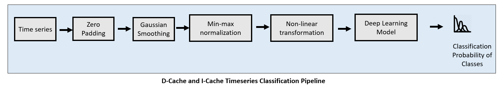

# cache_trace_analysis
A study of classification of input variables of program using data- and instruction-cache traces, as well as detection of leakage of information through programs.
The data, as documented in folder "data5", contains the d- and i-cache traces of a x86 program, which has input variables as certain strings.

## Methodology
### Input Variable Inference
We propose a data driven inference tool, that can infer the input variables, or atleast information about them, to a program from a given set of traces. This inference tool can be abstracted into two phases: information leakage and classification phase. This abstraction is shown in below figure. We proceed with describing these abstraction in following subsections.
 
 

 
 
#### Leakage Detection
Here, the differential analysis methodology from the paper "DATA – Differential Address Trace Analysis: Finding Address-based Side-Channels in Binaries" is applied where the constructed address and position probability distribution of the given fixed input variable is compared with random inputs to same program, and the leakage is detected if some statistical test like Kuiper's statistic is significant, that would imply difference in two probability distribution. However, we Kolmogorov two sample test is employed, instead Kuiper's test, that shows more robustness in our empricial analysis. We utilize the address trace data from d-cache and i-cache combined, in our analysis. The pipeline for Kolmogorov two sample test based leakage detection is shown in below figure.
 
 

 
 
#### Classification phase
Once the input variable is detected to be prone to leakage, we implement inference pipeline where we intend to estimate the information of that input variable. We model this problem as a data driven classification problem. Furthermore, we divide this task into two phases: grouping of input variables and deep learning based classification. We further explain these phases in following subsections.
 
 
##### Grouping of Input Variable
We tackle the problem of high correlation and matching among the d-cache and i-cache trace time series associated with certain input variables, which is possible in programs where more than one unique input may satisfy all conditionals associated with a problem to permit nearly same data and control-flow. Otherwise, directly inferring variable values in a deep learning classification framework would lead to confusion among certain variables, resistant to any feature extraction or model adopted.
 
 
Our approach is to group the highly correlated timeseries associated to input variables into several groups called 'classes'. Therefore, we shift the focus from infering the input variables to infering these classes with expected high success rate. An example is show below where the input variables named 'ant', 'air, 'health' and 'government' are grouped into three classes that showed high correlation in their associated time series.
 
 

 
 
We propose two different methodologies to this approach to systematically identify these classes among input variables in a data driven way. These pipelines are shown in following figure.
 
 

 
 
The first methodology, as shown as top flow diagram concerns with finding correlation matrix of dataset for each feature, and the positions of matrices represent correlation of features between two classes. We choose cosine similarity as the metric to measure similarity for these correlation matrices. Then the grouping is performed by analyzing these correlation matrices and identifying enteries of matrices, off-diagonal, that have value above certain threshold. If the identified enteries are same for all features, then corresponding input-variable pairs are grouped into one class. As an example, we show the case (shown in following figure) where for four input variables to a program having values 'ant', 'air', 'health' and 'government', the timeseries associated to 'ant' and 'air' show remarkable correlation for all features, and thus we would be prone to group them into one class.
 
 

 
 
The second methodology we propose is to search for groupings of input variables that allows best fitting of dummy model on the resultant classes. The dummy model can be any low parameter machine learning model like decision trees, support vector machines or multi-layer perceptron. In our methodology we choose random search, but such Baeysian based searches can also be considered. This pipeline is depicted in the bottom flow diagram of above figure. The finding of optimal grouping is demonstrated in below figure, where the accuracy of fitting the dummy model over random grouping of input variables (termed as partition) is shown, and the best groouping would be the one associated to global max of this curve.

 
 
##### Deep learning based classification
Once the classes have been identified, we find a data driven way to identify these classes from d-cache and i-cache time series data. In this regard, our pipeline is as follows:

The pipeline begins with zero-padding of time series to homogenize the length of all time series in the dataset. This is followed by Gaussian-smoothing and min-max normalization to improve the temporal representation of the time series to be learned by later deep learning model. We further introduce a non-linear transformation, as means to further improve the temporal representation further distinguish timeseries amongst classes. In this context, we add oscillations into the resultant normalized time series ,Tn via transformation.
T'n = Tn+sin(2&pi;Tn/max(Tn))
 
 
After this procedure, the resultant time series are fed into a deep learning models to produce classification probabilities associated to a particular class. After training of parameters of deep learning model, once the classes of a given trace timeseries is determined, then each input variable encapsulated in the class has 1/k probability of being associated to the given time series, where 'k' is the size of that class.
 
 
#### Dataset Description
The dataset collected for our inference tool is shown below (only d-cahce trace is shown), where there are total of four input variables: 'art', 'air','health' and 'government'. The associated trace timeseries for both d-cache and i-cache has total of seven features: 'ignore', 'command (read/write)', 'physical address', 'size','gem5 flags', 'timestamp' and 'program_counter'.
 
 

 
 
Inorder to increase the size of data, we also further subdivide the data into window of specfic size.
#### Results
##### Leakage Detection Phase
For leakage detection phase, we assume that that one of the input variable from dataset is fixed input, and other variables are random inputs. In our case, we consider 'air' as the fixed input, while 'art', 'health' and 'government' are random inputs. We consider the address traces from both d-cache and i-cache trace timeseries for constructing histograms for address and position. The constructed probability distribution from this data, and the p-value associated with Kolmogorov 2-sample test are shown in below figure. If the p-value is greater than 1-alpha, then there is a difference between distributions, and thus information leakage. We took as the value of alpha as 0.05 as it is the most standard choice. However, we may conclude that since for both address and position case, p-value is less than 1-alpha, and thus there is no information leakage. Therefore, theoretically, we donot need to jump towards classification phase. However, for our empirical analysis, we shall proceed anyway.
 
 

 
 
##### Classification Phase
We evaluated and compared our approach, by substituting deep learning with several architectures ranging over 1D and 2D input topology. For 2D input topology architectures, we compute Morse wavelet spectrogram of the timeseries data to achieve 2D representation. A comparison of phsycial address trace timeseries and its associated spectrogram representation is shown in following figure.
 
 

 
 
We considered the cases of only considering d-cache traces, and collective d-cache and i-cache traces seperately. The reason is that d-cache traces have relatively lower amount of correlation among input variables, with advantage of much lesser amount of samples for processing, thus providing motivation to consider them seperately. The comparison classification accuracy results are shown in below table, when several deep learning models are chosen to determine the classes of input variables. Amongst them, transfer learned Xception model has highest accuracy while the Transformer based models shown comparable accuracy with advatage of comprising relatively lesser parameters. Overall, for the program considered, the d-cache shows distinct behavior for different inputs to the program, to allow us to unilaterally consider it for inference reason.
 
 
**Table:** Performance results when only d-cache traces are considered

| Model ID | Description | Total number of Parameters | Epochs | Classification Accuracy | Input topology| 
| ------------- |-------------  | -------------  | -------------  | -------------  | -------------  |
| M1 | Transformer | 54988 |  30 | 87.5%  | 1D |
| M2 | Time2Vec-Transformer | 2182712 | 30  | 87.5% | 1D|
| M3 | Convolution Neural Network | 4996 | 100 |  87.5 % | 1D  |
| M4 | Long-Short Term Memory Network | 128516  |  30 | 62.5% | 1D |
| M5 | Xception Model transfer learned from ImageNet | 20910816 | 50 | 100.0% | 2D |
| M6 | ResNet |  2870224 |  50 |  87.5 % | 2D |

The corresponding confusion matrices are shown below for the models described in table-1. One thing that can be remarked from this is that different models confuse between different classes. This shows a possibility of ensemble approach.
 
 

 
 
We further consider the traces of d-cache and i-cache as representative of input variable interaction with the program. The comparison of performance for different models in this scenario is tabulated in following table. It is abundantly clear that transformer and Xception based models excel in handling large amount of features (total 14 from d-cache and i-cache traces), as well learning their latent representation to produce best classification performance. However, the performance of other models deteriorate when augmenting the i-cache trace data, which shows the limitation of model to combine information of all features of timeseries that can be mapped to classification probabilities.
 
 
**Table:** Performance results when both d-cache and i-cache traces are considered

| Model ID | Description | Total number of Parameters | Epochs | Classification Accuracy | Input topology| 
| ------------- |-------------  | -------------  | -------------  | -------------  | -------------  |
| M1 | Transformer | 54988 |  30 | 100.0 %  | 1D |
| M2 | Time2Vec-Transformer | 2182712 | 30  | 100.0 % | 1D|
| M3 | Convolution Neural Network | 4996 | 100 |  75.0 % | 1D  |
| M4 | Long-Short Term Memory Network | 128516  |  30 | 50.0 % | 1D |
| M5 | Xception Model transfer learned from ImageNet | 20910816 | 50 | 100.0% | 2D |
| M6 | ResNet |  2870224 |  50 |  50.0 % | 2D |

The corresponding confusion matrices of the model predictions are shown as follows.

# Expecting result(future works and plan)
